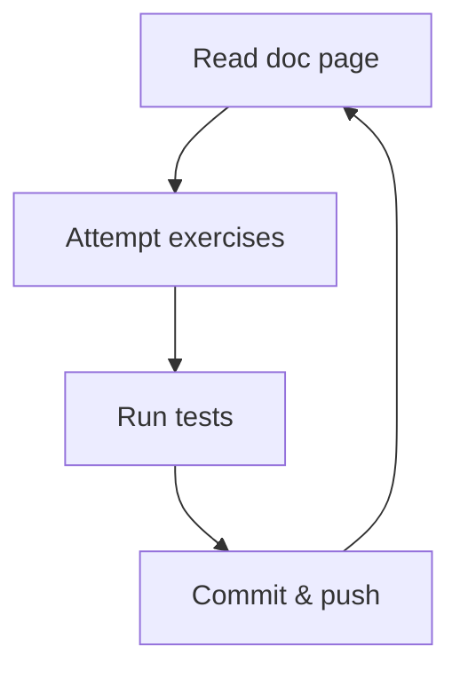

# Cash register

Welcome to the cash register! This is a library of functions to be used in
point-of-sale systems around the country.

## Deep dive

Before working on the functions, let's learn how to work with objects.

> [!NOTE]
>
> You can test the exercises using `npm run test:1a` and similar.

### Object properties

1. Read through [objects](https://tech-docs.corndel.com/js/objects.html) and
   [object tricks](https://tech-docs.corndel.com/js/object-tricks.html)

1. Solve, commit and push [exercise 1a](./exercises/1a.js)

1. Solve, commit and push [exercise 1b](./exercises/1b.js)

### Lists of objects

1. Read through
   [lists of objects](https://tech-docs.corndel.com/js/lists-of-objects.html)

1. Solve, commit and push [exercise 2a](./exercises/2a.js)

1. Solve, commit and push [exercise 2b](./exercises/2b.js)

### Object nesting

1. Read through
   [object nesting](https://tech-docs.corndel.com/js/object-nesting.html)

1. Solve, commit and push [exercise 3a](./exercises/3a.js)

1. Solve, commit and push [exercise 3b](./exercises/3b.js)

## Workshop

> [!NOTE]
>
> You can test the functions using `npm run test:level-1` and similar.

Check out [drawer.js](./drawer.js) to see the data structure you will be dealing
with.

### Level 1

Complete the `removeItem` function which removes a single item from the drawer.

Complete the `addItem` function which adds a single item to the drawer.

### Level 2

Complete the `countCoins` function which counts how many coins are in the
drawer.

Complete the `countNotes` function which counts how many notes are in the
drawer.

### Level 3

Complete the `sumDrawer` function which calculates the total amount of money in
the drawer.

### Level 4

Complete the `canMakeAmount` function which determines whether it is possible to
create a specific cash amount from the items in the drawer.

### Level 5

Complete the `transaction` function which works out the change required from a
transaction and removes it from the drawer if possible.
